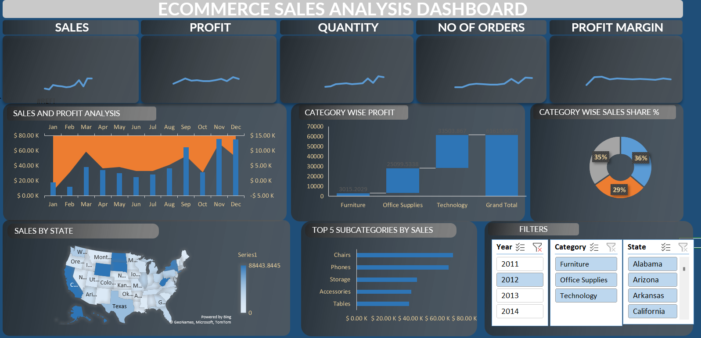

# E-Commerce Sales Analysis Dashboard

## 📌 Project Overview
This project is an E-Commerce Sales Analysis Dashboard developed to analyze sales performance, profit trends, customer purchasing behavior, and category-wise business insights.

The dashboard helps businesses understand sales growth, profit distribution, regional performance, and top-performing product categories for better decision-making.

The dataset used for this project was taken from Kaggle and visualized using Power BI.

---

## 📊 Dashboard Preview

---

## 🚀 Features

- Sales Performance Analysis
- Profit Tracking
- Quantity Sold Analysis
- Number of Orders Overview
- Profit Margin Monitoring
- Category-wise Profit Analysis
- Category-wise Sales Share
- State-wise Sales Visualization
- Top 5 Subcategories by Sales
- Interactive Filters for Year, Category, and State

---

## 📈 Key Insights

- Technology category generated the highest profit.
- Furniture and Office Supplies contributed significantly to overall sales.
- Certain states showed higher sales concentration compared to others.
- Phones and Chairs were among the top-performing subcategories.
- Profit margin remained stable across different periods.

---

## 🛠️ Tools & Technologies Used

- Power BI
- Microsoft Excel / CSV
- Kaggle Dataset
- Data Cleaning & Visualization Techniques

---

## 📂 Dataset

Dataset Source: Kaggle E-Commerce Sales Dataset

---

## 📌 KPIs Used

- Total Sales
- Total Profit
- Quantity Sold
- Number of Orders
- Profit Margin

---

## 🎯 Objective

The main objective of this dashboard is to:
- Analyze sales and profit performance
- Identify high-performing product categories
- Track regional sales distribution
- Support data-driven business decisions
- Monitor overall e-commerce growth trends

---

## 📷 Dashboard Components

| Section | Description |
|----------|-------------|
| KPI Cards | Displays important business metrics |
| Sales & Profit Chart | Monthly sales and profit comparison |
| Category Analysis | Profit and sales distribution by category |
| Map Visualization | State-wise sales performance |
| Top Subcategories | Best-performing products by sales |
| Filters | Interactive filtering options |

---

## 🔮 Future Improvements

- Add customer segmentation analysis
- Include sales forecasting using Machine Learning
- Add real-time sales database integration
- Improve dashboard responsiveness and UI design

---

## ⭐ If you like this project

Give this repository a ⭐ on GitHub and support the project.
